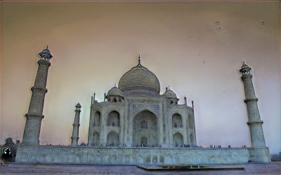

 |                                   |  |  |  |  |  |  |  |  |  |
 | --------------------------------- | --------------------------------- | --------------------------------- | --------------------------------- | --------------------------------- | --------------------------------- | --------------------------------- | --------------------------------- | --------------------------------- | --------------------------------- |
 |  |  |  |  |  |  |  |  |  |  |
 |  |  |  |  |  |  |  |  |  |  |
 |  |  |  |  |  |  |  |  |  |  |
 |  |  |  |  |  |  |  |  |  |  |
 |  |  |  |  |  |  |  |  |  |  |
 |  |  |  |  |  |  |  |  |  |  |
 |  |  |  |  |  |  |  |  |  |  |
 |  |  |  |  |  |  |  |  |  |  |
 |  |  |  |  |  |  |  |  |  |  |
